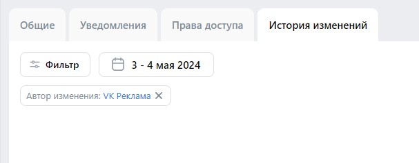

# Домашнее задание 3

## Навбар
https://ads.vk.com/hq/overview  

 
- При нажатии на логотип происходит редирект на страницу https://ads.vk.com/hq/overview, при нахождении не на этой странице
- При нажатии на иконку кошелька или на счёт появляется окно для пополнения счета (будет протестировано ниже)
- При нажатии на иконку колокольчика появляется окно для уведомлений
  
- При нажатии на аватар пользователя появляется пользовательское меню с кнопкой "Выйти"
- При нажатии на кнопку "Выйти" происходит выход из аккаунта
и происходит редирект https://ads.vk.com

## Бюджет
https://ads.vk.com/hq/budget/transactions  

- При нажатии на кнопку "Пополнить счёт" открывается окно для пополнения счёта(как и в навбаре)
  
- При нажатии на крестик окно для пополнения счёта закрывается
- В поле "Сумма к оплате" нельзя ввести не числовые значения
- В поле "Сумма, поступающая на ваш счёт" нельзя ввести не числовые значения
- При нажатии на иконку вопроса открывается окно с пояснением
  
    - При нажатии на надпись "Подробнее о минимальном платеже и НДС" происходит редирект на страницу https://ads.vk.com/help/articles/billing#min  
- При вводе суммы, меньшей 600 рублей, в поле "Сумма к оплате" появляется ошибка "Минимальная сумма 600,00 ₽"
- При вводе суммы, меньшей 500 рублей, в поле "Сумма, поступающая на ваш счёт" появляется ошибка "Минимальная сумма 600,00 ₽"
- При вводе допустимой суммы и при нажатии на кнопку "Пополнить счёт" появляется окно для оплаты

## Настройки
https://ads.vk.com/hq/settings  

- При изменении любого из полей появлются кнопки "Сохранить" и "Отменить"
- При вводе значений не по формату телефонного номера (Пример: +71234567890) и нажатии кнопки "Сохранить" появляется ошибка "Некорректный номер телефона"
- Если не заполнить все обязательные поля и нажать кнопку "Сохранить", выводится ошибка  "Обязательное поле" над каждым из этих незаполненных полей
- При нажатии на кнопку "Добавить email" появляется ещё одно поле для email 
- Добавить больше 5 таких полей нельзя
- При вводе ИНН меньше 12 знаков выводится ошибка "Длина ИНН должна быть 12 символов" 
- При вводе в поле "ИНН" любого знака кроме цифры выводится ошибка "Некорректный ИНН" 
- При нажатии на поле "Язык интерфейса" выдается список доступных языков
- При нажатии на другой язык, он меняется в поле
- При нажатии на надпись "Подробнее о доступе" под заголовком "Доступ к API" происходит редирект на страницу https://ads.vk.com/help/articles/help_api
- При нажатии на кнопку "Запросить доступ к API" выводится окно

- При вводе значений не по формату телефонного номера (Пример: +71234567890) и нажатии кнопки "Запросить доступ" появляется ошибка "Некорректный номер телефона"
- При нажатии на кнопку "Выйти из других устройств" появляется надпись "Активные сеансы на других устройствах успешно завершены."
- При нажатии на кнопку "Удалить кабинет" появляется выводится окно для подтверждения удаления

- При нажатии на кнопку "Уведомления" появляется окно

- При нажатии email разблокируются новые разделы

- При нажатии на надпись "Финансы" чекбокс заполняется, при повторном нажатии чекбокс очищается
- При нажатии на надпись "Модерация" чекбокс заполняется, при повторном нажатии чекбокс очищается
- При нажатии на надпись "Рекламные кампании" чекбокс заполняется, при повторном нажатии чекбокс очищается
- При нажатии на надпись "Правила для объявлений" чекбокс заполняется, при повторном нажатии чекбокс очищается
- При нажатии на надпись "Изменения в API" чекбокс заполняется, при повторном нажатии чекбокс очищается
- При нажатии на надпись "Новости" чекбокс заполняется, при повторном нажатии чекбокс очищается
- При нажатии на надпись "Мероприятия" чекбокс заполняется, при повторном нажатии чекбокс очищается
- При нажатии на надпись "Акции, спецпредложения и прочие" чекбокс заполняется, при повторном нажатии чекбокс очищается
- Баг. При наведении на знак вопроса рядом с надписью "Финансы" появится пустое всплывающее окно

- При нажатии на кнопку "Права доступа" появляется окно

- При нажатии на кнопку "Добавить кабинет" появляется окно

- При пустом вводе в поле "ID аккаунта VK Рекламы" появляется ошибка "Обязательное поле"
- При нажатии на кнопку "Только чтение" открываются чекбоксы 

- При нажатии на кнопку "Расширенные права" открываются ещё чекбоксы

- При нажатии на кнопку "История изменений" появляется окно

- При нажатии на кнопку "Фильтр" появляется окно

- При нажатии на кнопку "Тип объекта" меняется содержимое окна "Фильтр"

- При нажатии на кнопку "Выбрать все" выделяются все чекбоксы
- При нажатии на кнопку "Сбросить все" все чекбоксы перестают быть выделенными
- При нажатии на кнопку "Сбросить" все чекбоксы выбранного окна перестают быть выделенными
- При нажатии на кнопку "Что изменилось" меняется содержимое окна "Фильтр"

- При нажатии на кнопку "Автор изменения" меняется содержимое окна "Фильтр"

- При нажатии кнопки "Отмена" окно фильтров закрывается
- При нажатии кнопки "Сохранить" окно закрывается и на главном окне появляются фильтры

- При нажатии на значок крестика фильтр исчезает
- При нажатии на дату появляется окно с календарем и выбором дат

- При нажатии "Сегодня" в поле с датой запишется дата этого дня в обоих полях дат и отобразится на календаре
- При нажатии "Вчера" в поле с датой запишется дата предыдущего дня в обоих полях дат и отобразится на календаре
- При нажатии "Эта неделя" в поле с датой запишется диапазон этой недели в обоих полях и отобразится на календаре
- При нажатии "Прошлая неделя" в поле с датой запишется диапазон прошлой недели  и отобразится на календаре
- При нажатии "Этот месяц" в поле с датой запишется диапазон этого месяца до нынешней даты и отобразится на календаре
- При нажатии "Прошлый месяц" в поле с датой запишется диапазон прошлого месяца   и отобразится на календаре
- При нажатии "Последний 31 день" в поле с датой запишется диапазон 31 дня от нынешнего и отобразится на календаре
- При нажатии кнопки "Отменить" окно выбора дат закрывается
- При нажатии кнопки "Применить" выбранные даты отобразятся в соответствующем поле

