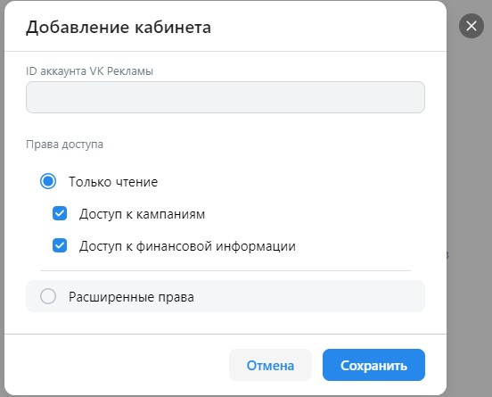

# Домашнее задание 3

## Навбар
https://ads.vk.com/hq/overview  

 
- При нажатии на логотип происходит редирект на страницу https://ads.vk.com/hq/overview, при нахождении не на этой странице
- При нажатии на иконку кошелька или на счёт появляется окно для пополнения счета (будет протестировано ниже)
- При нажатии на иконку колокольчика появляется окно для уведомлений
  
- При нажатии на аватар пользователя появляется пользовательское меню с кнопкой "Выйти"
- При нажатии на кнопку "Выйти" происходит выход из аккаунта
и происходит редирект https://ads.vk.com

## Бюджет
https://ads.vk.com/hq/budget/transactions  

- При нажатии на кнопку "Пополнить счёт" открывается окно для пополнения счёта(как и в навбаре)
  
- При нажатии на крестик окно для пополнения счёта закрывается
- В поле "Сумма к оплате" нельзя ввести не числовые значения
- В поле "Сумма, поступающая на ваш счёт" нельзя ввести не числовые значения
- При нажатии на иконку вопроса открывается окно с пояснением
  
    - При нажатии на надпись "Подробнее о минимальном платеже и НДС" происходит редирект на страницу https://ads.vk.com/help/articles/billing#min  
- При вводе суммы, меньшей 600 рублей, в поле "Сумма к оплате" появляется ошибка "Минимальная сумма 600,00 ₽"
- При вводе суммы, меньшей 500 рублей, в поле "Сумма, поступающая на ваш счёт" появляется ошибка "Минимальная сумма 600,00 ₽"
- При вводе допустимой суммы и при нажатии на кнопку "Пополнить счёт" появляется окно для оплаты

## Настройки
https://ads.vk.com/hq/settings  

- При изменении любого из полей появлются кнопки "Сохранить" и "Отменить"
- При вводе значений не по формату телефонного номера (Пример: +71234567890) и нажатии кнопки "Сохранить" появляется ошибка "Некорректный номер телефона"
- Если не заполнить все обязательные поля выводится ошибка  "Обязательное поле" над каждым из этих незаполненных полей
- При нажатии на кнопку "Добавить email" появляется ещё одно поле для email 
- При вводе ИНН меньше 12 знаков выводится ошибка "Длина ИНН должна быть 12 символов" 
- При вводе в поле "ИНН" любого знака кроме цифры выводится ошибка "Некорректный ИНН" 
- При нажатии на поле "Язык интерфейса" выдается список доступных языков
- При нажатии на надпись "Подробнее о доступе" под заголовком "Доступ к API" происходит редирект на страницу https://ads.vk.com/help/articles/help_api
- При нажатии на кнопку "Выйти из других устройств" появляется надпись "Активные сеансы на других устройствах успешно завершены."
- При нажатии на кнопку "Удалить кабинет" появляется выводится окно для подтверждения удаления:  

- При нажатии на кнопку "Уведомления" появляется окно:  

- При нажатии на кнопку "Права доступа" появляется окно:  

- При нажатии на кнопку "Добавить кабинет" появляется окно:  

- При нажатии на кнопку "История изменений" появляется окно
:  

